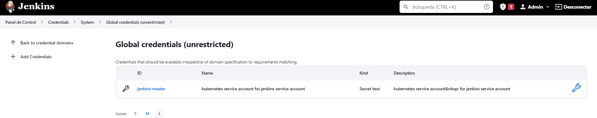
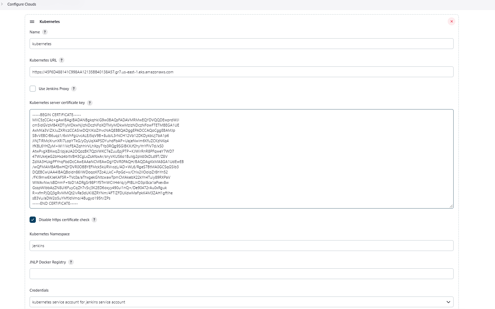
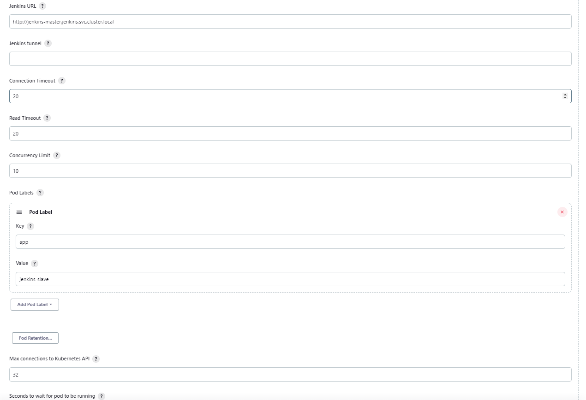
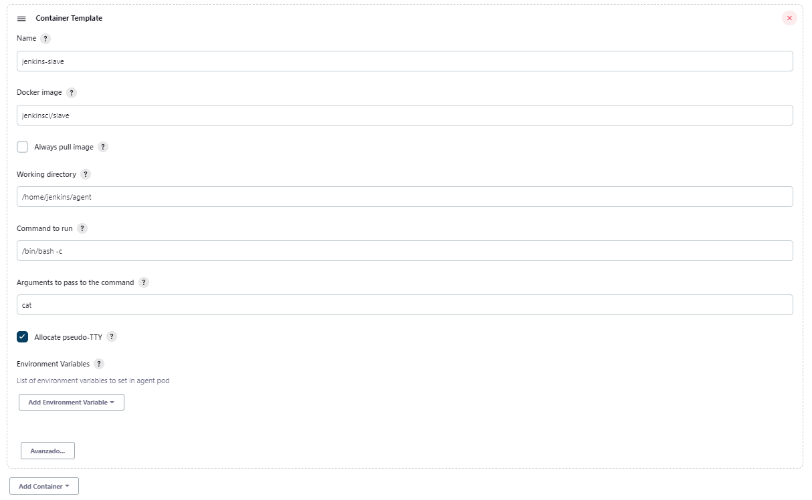
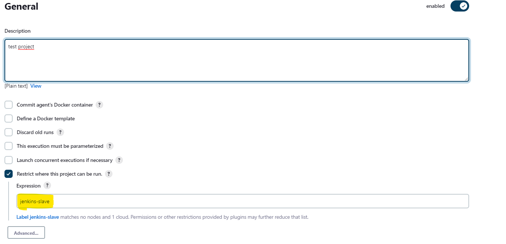
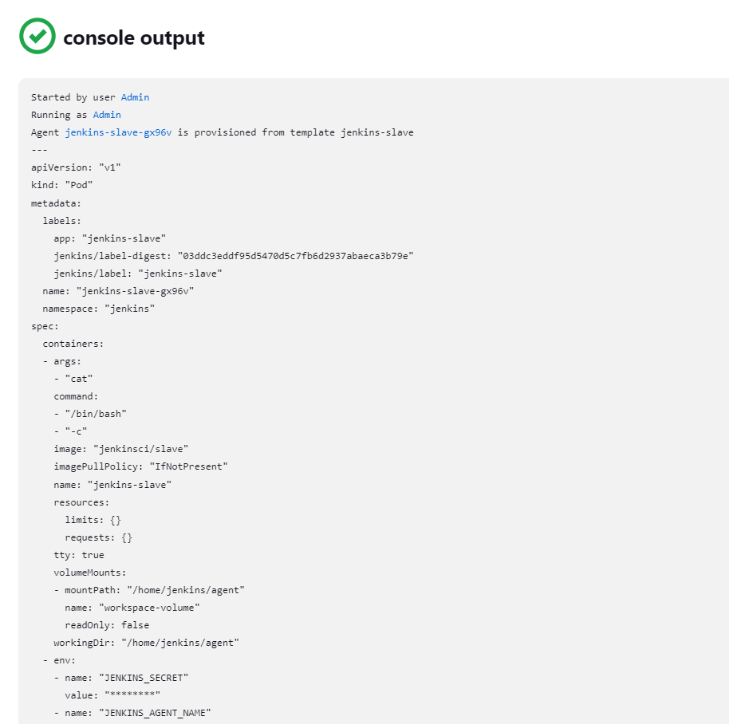

# Terraform EKS and EFS driver.


[](https://plugins.jenkins.io/configuration-as-code/)


In this repository there is an example of how to deploy a cluster of eks and efs drivers so that the cluster has control of the life cycle

<!-- ## EKS deploy

### variables:
> all variables are used in this step are in eks-cluster/variables. tf


```bash
export KUBE_CONFIG_PATH=/path/to/kubeconfig
aws efs describe-file-systems --query "FileSystems[*].FileSystemId" --output text

``` -->

## Jenkins instance
Jenkins instance on kubernetes cluster with efs persistent volume claim. Likewise, the jenkins instance can perform the deployment of pods as agents for the execution of jobs and at the end of the task it must eliminate them.

### Resources
- Persistent Volume Claim: This persistent volume claim requests storage of type `efs-sc` which is the storage class previously configured in the kubernetes cluster.
- ConfigMaps:
    - jenkins-plugin: In this configmap the data contained in the externals/plugins.txt file will be loaded to be used by the init container to install said plugins.
    - jenkins-casc-config: In this configmap the data contained in the externals/casc.yaml file will be loaded to be used by jenkins-master instance for run bootstrap configuration with the help of plugin [jenkins configuration as a code](https://plugins.jenkins.io/configuration-as-code/) Here is an example of implementing it -> [github/jenkinsci/configuration-as-code-plugin](https://github.com/jenkinsci/configuration-as-code-plugin/blob/master/demos/embedded-userdatabase/README.md)
- Deployment: Is the deployment for the master instance of jenkins, it consists of two containers, the init container to install the plugin dependencies and the main container that shares the pvc with the init container for the jenkins-home directory `/var/jenkins_home` where previously The plugins were installed, it also mounts the value of configmap as a volume to create the yaml file with the configuration for the user and other security configuration related to the jenkins instance.
- Service Account: Jenkins needs to access the Kubernetes API, therefore you need to properly setup a Kubernetes Service Account and Role in order to represent Jenkins access for the Kubernetes API.
- Role: Create required access Role and RoleBinding for jenkins-master in jenkins namespace
    - Rules:
        - resources: ["pods"]
            - verbs: ["create","delete","get","list","patch","update","watch"]
        - resources: ["pods/exec"]
            - verbs: ["create","delete","get","list","patch","update","watch"]
        - resources: ["pods/log"]
            - verbs: ["get","list","watch"]
        - resources: ["events"]
            - verbs: ["get","list","watch"]
        - resources: ["secrets"]
            - verbs: ["get"]
### Variables
Create a new file called `terraform.tfvars` and copy these variables with the custom values. in the variables.tf file you will find some more related to the project
```HCL
region                  = "us-east-1"
webfocus_role           = "arn:aws:iam::123456789012:role/webfocus"
jenkins_master_password = "m4x7bMvjIDdGqN+a"
jenkins_master_username = "exampleuser"
```
### Apply
```bash
# install plugins and modules
terraform init

# get preview of project resources
terraform plan

# apply all resources 
terraform apply
```

### Output
```bash
kubernetes_service_external_ip = "http://a3a51d82qsd3ed41e2ac776a49cc4646b-example.us-east-1.elb.amazonaws.com"
```
> ## In jenkins 

### Setup Jenkins Cloud Configuration and Slave Pod Specification
First, you have to register the jenkins-master service account to Jenkins credential manager, navigate to *Credentials > Systems > Global Credentials*
Create a new secret text


```bash
# jenkins-master service account token
kubectl get secret $(kubectl get sa jenkins-master -n jenkins -o jsonpath={.secrets[0].name}) -n jenkins -o jsonpath={.data.token} | base64 --decode
```

Next, you have to get these values to setup cloud configuration properly:

- Kubernetes API server address: 
    ```bash
    kubectl config view --minify | grep server | cut -f 2- -d ":" | tr -d " "
    ```
- Kubernetes server CA certificate key:
    ```bash
    kubectl get secret $(kubectl get sa jenkins-master -n jenkins -o jsonpath={.secrets[0].name}) -n jenkins -o jsonpath={.data.'ca\.crt'} | base64 --decode
    ```
To configure cloud provider navigate to Manage Jenkins > Manage Nodes and Clouds > Configure Clouds.





> Important: use kube DNS name (http://jenkins-master.jenkins.svc.cluster.local) as Jenkins URL instead of http://a3a51d82qsd3ed41e2ac776a49cc4646b-example.us-east-1.elb.amazonaws.com or http://127.0.0.1:8080. And test connection to make sure everything works.

### Set Up a Project
You need to make sure that:

The project only execute on slave node with correct label which is jenkins-slave.



### Start Building!
Go to your project and hit “Build Now”, if you done everything correctly you will see that Jenkins is provisioning your slave node inside a Kubernetes pod when you navigate to “Console Ouput”.

You can also see that the build job is running on labeled slave node in your Build History sidebar inside your project page.




## References:
- https://aws.amazon.com/es/blogs/devops/orchestrate-jenkins-workloads-using-dynamic-pod-autoscaling-with-amazon-eks/
    
- https://github.com/aws-samples/jenkins-cloudformation-deployment-example/blob/main/k8s/manifest.yaml
    
- https://github.com/jenkinsci/configuration-as-code-plugin/blob/master/demos/embedded-userdatabase/README.md
